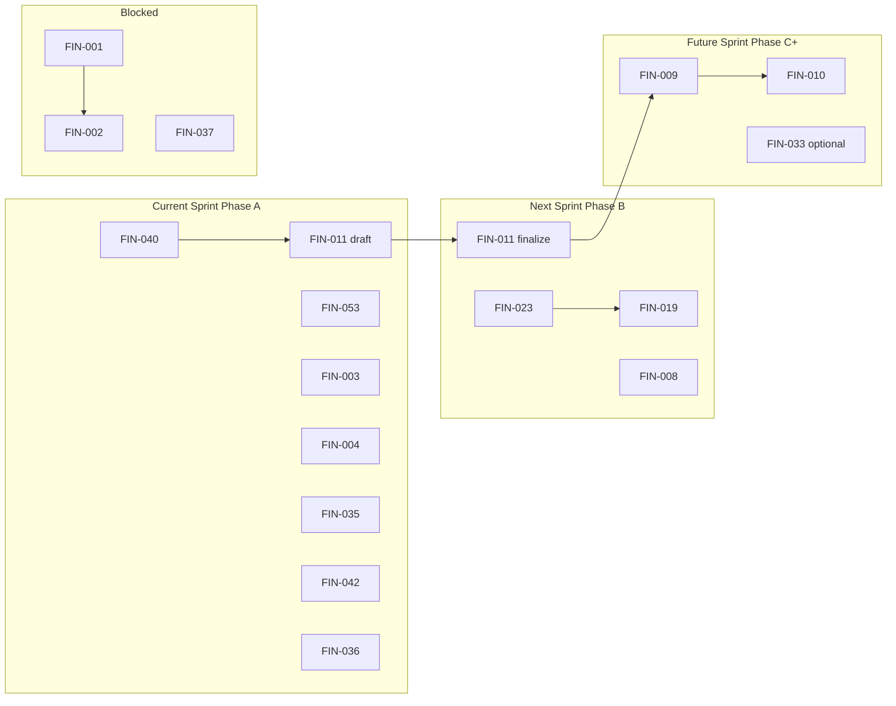

# FINCAVA Execution Backlog

**Planning sources:** `FINCAVA_MASTER_REGISTER.md` · `FINCAVA_PRIORITIZATION.md`  
**Status:** Active execution plan (no implementation tasks below)  
**Horizon:** Approved 60-day sequencing (Phase A → B → C)  
**Last updated:** 2026-05-31  

**How to use:** Move items to **Completed** when the expected outcome is verified. Do not delete FIN IDs. Do not add new FIN IDs here—only items from the master register.

---

## Sprint calendar (60-day plan)

| Sprint | Phase | Target window | Theme |
|--------|-------|---------------|--------|
| **Current** | A | Days 1–14 | Stay safe & stop losing leads |
| **Next** | B | Days 15–35 | Trust pipeline tells the truth |
| **Future** | C + queue | Days 36–60+ | Revenue loop tightens; post-60 hygiene |

---

## 1. Current Sprint

**Phase A — Days 1–14:** `FIN-040` → `FIN-011` (draft) → `FIN-053` → `FIN-003` → `FIN-004`, with `FIN-035` · `FIN-042` · `FIN-036` in parallel.

---

~~### FIN-040 — Replit ↔ GitHub sync discipline~~ ✅ **Completed 2026-06-06** — see Section 5.

---

~~### FIN-011 — Operator playbook documentation *(draft phase)*~~ ✅ **Draft completed 2026-06-06** — see Section 5. Finalise in Phase B after FIN-023/019.

---

~~### FIN-053 — `UPLOAD_TOKEN_SECRET` in `.replit` shared env~~ ✅ **Completed 2026-06-06** — see Section 5.

---

~~### FIN-003 — Officer registration API path bug~~ ✅ **Completed 2026-06-01** — see Section 5.

---

~~### FIN-004 — Contact form has no backend~~ ✅ **Completed 2026-06-01** — see Section 5.

---

~~### FIN-035 — Shallow health check (no DB probe)~~ ✅ **Completed 2026-06-01** — see Section 5.

---

~~### FIN-042 — Automated DB backup not scheduled~~ ✅ **Completed 2026-06-06** — see Section 5.

---

~~### FIN-036 — No error monitoring or alerting (Sentry/Datadog)~~ ✅ **Completed 2026-06-01** (code) — pending `SENTRY_DSN` secret — see Section 5.

---

## 2. Next Sprint

**Phase B — Days 15–35:** `FIN-023` → `FIN-019`; `FIN-011` (finalize); `FIN-008`.

---

~~### FIN-011 — Operator playbook documentation *(finalize phase)*~~ ✅ **Completed 2026-06-06** — see Section 5.

---

~~### FIN-023 — `rut_dian` body field vs eligibility gate mismatch~~ ✅ **Completed 2026-06-01** — see Section 5.

---

~~### FIN-019 — AI compliance gaps not written back to `compliance_docs`~~ ✅ **Completed 2026-06-01** — see Section 5.

---

~~### FIN-008 — Hardcoded admin alert email on supplier onboard~~ ✅ **Completed 2026-05-06** — see Section 5.

---

## 3. Future Sprint

**Phase C — Days 36–60:** `FIN-009` → `FIN-010`; optional `FIN-033`.  
**Post-60 queue:** items approved for after Current + Next, still within Phase I constraints.

---

~~### FIN-009 — Email notifications on new RFQ/inquiry~~ ✅ **Completed 2026-06-01** — see Section 5.

---

~~### FIN-010 — Admin “open introductions” dashboard~~ ✅ **Completed 2026-06-01** — see Section 5.

---

~~### FIN-033 — Ingestion batch confirm does not auto-trigger scoring (G9)~~ ✅ **Completed 2026-06-01** — see Section 5.

---

~~### FIN-006 — Concierge introduction workflow not operator-optimized~~ ✅ **Completed 2026-06-06** — see Section 5.

---

### FIN-020 — Three parallel compliance representations

| Field | Detail |
|-------|--------|
| **Reason for priority** | Follow-on trust hygiene after FIN-019 |
| **Dependencies** | FIN-019 |
| **Expected outcome** | Documented single source of truth for compliance state; plan for `interactions.metadata` vs `compliance_docs` alignment |
| **Estimated effort** | Medium |

---

### FIN-041 — Migration hygiene issues

| Field | Detail |
|-------|--------|
| **Reason for priority** | Post-60 stability; deferred until backups and monitoring stable (per prioritization) |
| **Dependencies** | FIN-042, FIN-036 |
| **Expected outcome** | Migration journal audited; orphan SQL resolved; post-merge uses `migrate` not `push`; package filter corrected |
| **Estimated effort** | Medium |

---

### FIN-043 — AI (Anthropic) dependency with limited fallback

| Field | Detail |
|-------|--------|
| **Reason for priority** | Operational runbook after monitoring live |
| **Dependencies** | FIN-036 |
| **Expected outcome** | Documented key rotation, outage playbook, and founder-visible signal when scoring/matching unavailable |
| **Estimated effort** | Small (process) |

---

### FIN-045 — Resend email skips send without API key

| Field | Detail |
|-------|--------|
| **Reason for priority** | Startup validation prevents silent auth failure |
| **Dependencies** | FIN-036 (alerts when misconfigured) |
| **Expected outcome** | API refuses start or logs critical warning if `RESEND_API_KEY` missing in production |
| **Estimated effort** | Tiny |

---

### FIN-044 — WhatsApp (Twilio) fails silently without credentials

| Field | Detail |
|-------|--------|
| **Reason for priority** | Onboarding channel visibility |
| **Dependencies** | FIN-036 |
| **Expected outcome** | Missing Twilio config surfaces in logs/alerts; operator knows WhatsApp step may be skipped |
| **Estimated effort** | Tiny |

---

### FIN-007 — Buyer matching gated and not workflow-integrated

| Field | Detail |
|-------|--------|
| **Reason for priority** | Revenue enabling after introduction queue exists |
| **Dependencies** | FIN-010; `ENABLE_MATCHING`; FIN-011 matching SOP |
| **Expected outcome** | Founder workflow: run match → review → intro → follow-up documented and practiced |
| **Estimated effort** | Medium |

---

### FIN-029 — Public trust badge refinement needed

| Field | Detail |
|-------|--------|
| **Reason for priority** | Buyer-facing trust after FIN-019 data is truthful |
| **Dependencies** | FIN-019; optionally FIN-022 (Later) |
| **Expected outcome** | `/suppliers` and profiles communicate verification meaning clearly to buyers |
| **Estimated effort** | Medium |

---

## 4. Blocked

Items are in the register as Must Do Now or Next but **cannot start** within the 60-day plan without a decision, large effort, or upstream completion.

---

~~### FIN-001 — Two supplier systems with no database link~~ ✅ **Completed 2026-06-06** — see Section 5.

---

~~### FIN-002 — Farm suppliers lack self-service login for compliance~~ ✅ **Completed 2026-06-08** — see Section 5.

---

### FIN-065 — Compliance Concierge layer complete but farmer auth gap

| Field | Detail |
|-------|--------|
| **Reason for priority** | Compliance Must Do Now |
| **Dependencies** | ~~Blocked by FIN-002~~ — FIN-002 shipped 2026-06-08; now unblocked |
| **Expected outcome** | CC-1 fully usable by target farm suppliers via WhatsApp OTP or email magic link |
| **Estimated effort** | Small — verify CC-1 flow end-to-end with a farm supplier account |

---

### FIN-037 — Onboard/scoring pipeline has no durable job queue (H7)

| Field | Detail |
|-------|--------|
| **Reason for priority** | High operational risk; explicitly deferred from 60-day top 10 |
| **Dependencies** | **Blocked by:** Effort (Large); infrastructure decision |
| **Expected outcome** | *(When unblocked)* Scoring jobs survive process restart; recovery for stuck suppliers |
| **Estimated effort** | Large |
| **Mitigation until unblocked** | FIN-011 “stuck supplier” checklist; manual “Score Now” |

---

### FIN-058 — Field officers require full ADMIN role (G8)

| Field | Detail |
|-------|--------|
| **Reason for priority** | Security Must Do Now |
| **Dependencies** | **Blocked by:** FIN-059 role design; defer until after FIN-003 proves officer recruitment |
| **Expected outcome** | Officers do not require full admin access |
| **Estimated effort** | Medium |

---

### FIN-059 — FIELD_OFFICER role not implemented in route guards

| Field | Detail |
|-------|--------|
| **Reason for priority** | Prerequisite for FIN-058, FIN-066, FIN-067 |
| **Dependencies** | **Blocked by:** Scoped permission definition; FIN-003 complete |
| **Expected outcome** | Route guards accept `FIELD_OFFICER` with least privilege |
| **Estimated effort** | Medium |

---

### FIN-066 — Officer applications have no promotion flow (G10)

| Field | Detail |
|-------|--------|
| **Reason for priority** | Scale field team |
| **Dependencies** | **Blocked by:** FIN-003; FIN-059 |
| **Expected outcome** | Application → approved officer account without manual DB/user creation |
| **Estimated effort** | Medium |

---

### FIN-067 — Officer compliance workflow ADMIN-gated

| Field | Detail |
|-------|--------|
| **Reason for priority** | Field compliance at scale |
| **Dependencies** | **Blocked by:** FIN-059 |
| **Expected outcome** | Officers access compliance tools without ADMIN role |
| **Estimated effort** | Medium |

---

### FIN-005 · FIN-098–FIN-112 — Phase II+ / Parking Lot (representative block)

| Field | Detail |
|-------|--------|
| **Reason for priority** | Register items deferred by Phase I concierge strategy |
| **Dependencies** | **Blocked by:** Product strategy (no transactions, finance, logistics, public intelligence in Phase I) |
| **Expected outcome** | *(When unblocked)* Per `FINCAVA_MASTER_REGISTER.md` definitions |
| **Estimated effort** | Varies (Medium–XL) |
| **FIN IDs** | FIN-005, FIN-098, FIN-099, FIN-100, FIN-101, FIN-102, FIN-103, FIN-104, FIN-105, FIN-106, FIN-107, FIN-108, FIN-109, FIN-110, FIN-111, FIN-112 |

---

## 5. Completed

| Completed | FIN ID | Title | Verified outcome (summary) |
|-----------|--------|-------|----------------------------|
| 2026-05-06 | FIN-008 | Hardcoded admin alert email | `getAdminEmails()` queries DB for all ADMIN users dynamically. Backfilled 2026-06-06. |
| 2026-06-01 | FIN-023 | `rut_dian` vs eligibility gate mismatch | `has_rut=true` now seeds DIAN_RUT requirement + sets `complianceDocs.rutDian`. Backfilled 2026-06-06. |
| 2026-06-01 | FIN-019 | AI gaps not written back to `compliance_docs` | `GAP_TO_COMPLIANCE_FIELD` map in scoring-service writes back after AI scoring. Backfilled 2026-06-06. |
| 2026-06-06 | FIN-040 | Replit ↔ GitHub sync discipline | Bidirectional ritual documented in OPERATOR_PLAYBOOK.md §8. Flow A (Replit Agent → fincava → fincava-hub) and Flow B (local dev → fincava-hub → fincava) both covered. Process in active use. |
| 2026-06-01 | FIN-003 | Officer registration API path bug | Route had `/api` prefix inside a router already mounted at `/api` → double path. Removed prefix. Backfilled 2026-06-06. |
| 2026-06-01 | FIN-004 | Contact form has no backend | `POST /api/contact` wired to Resend; submissions reach operator inbox. Backfilled 2026-06-06. |
| 2026-06-08 | FIN-002 | Farm suppliers lack self-service login | WhatsApp OTP (6-digit, 10min TTL) + email magic link (UUID, 24hr TTL) both implemented. Migration 0037 (`supplier_auth_tokens`). Public `/supplier-login` page + admin drawer "Send Login Link". Pre-flight claim on self-registration (Option A). Commits: `e1b4503`, `4853ca0`. |
| 2026-06-01 | FIN-035 | Shallow health check (no DB probe) | `/healthz` + `/health` both probe DB via `SELECT 1`; return 503 on failure. Backfilled 2026-06-06. |
| 2026-06-01 | FIN-036 | No error monitoring (Sentry) | `instrument.ts` initialises Sentry; `SENTRY_DSN` confirmed in Replit Secrets 2026-06-06. Fully active. |
| 2026-06-06 | FIN-042 | Automated DB backup scheduler | `[[cron]]` added to `.replit` — daily at 03:00 UTC using `BACKUP_SECRET_V2`. 7-backup retention in service. |
| 2026-06-06 | FIN-011 | Operator playbook (draft) | `docs/runbooks/OPERATOR_PLAYBOOK.md` created — full supplier pipeline, compliance, RFQ, intro SOP, deploy ritual, flags, backup, secrets. Finalise after FIN-023/019. |
| 2026-06-06 | FIN-001 | Two supplier systems with no database link | `company_supplier_links` join table (migration `0028`) bridges `suppliers` ↔ `companies`. Many-to-many model supports cooperatives. Admin CRUD endpoints shipped. Both repos synced. Typecheck + 199/199 tests passing. Migration applied to dev + prod DB. |
| 2026-06-06 | FIN-053 | `UPLOAD_TOKEN_SECRET` in `.replit` shared env | Secret removed from committed `.replit`; moved to Replit Secrets. One-line deletion, no behaviour change. |
| 2026-06-01 | FIN-009 | Email notifications on new RFQ/inquiry | `rfqs.ts` sends `newRfqAdminAlertEmail` to all admin users on RFQ creation; `inquiries.ts` sends `newInquiryEmail` to supplier + `newInquiryAdminAlertEmail` to admins. Backfilled 2026-06-06. |
| 2026-06-01 | FIN-010 | Admin "open introductions" dashboard | `GET /api/admin/open-introductions` endpoint exists in `admin.ts` (tagged FIN-010). Lists open RFQs/inquiries awaiting founder action. Backfilled 2026-06-06. |
| 2026-06-01 | FIN-033 | Ingestion batch confirm auto-triggers scoring | `batch-confirm` handler calls `runOnboardPipeline()` after confirming each supplier — no separate "Score Now" click needed. Backfilled 2026-06-06. |
| 2026-06-06 | FIN-011 | Operator playbook (final) | `OPERATOR_PLAYBOOK.md` finalised — status updated to Final; FIN-023/019 compliance note corrected (both shipped 2026-06-01); Phase C tools (FIN-009/010/033/006) added to relevant sections. |
| 2026-06-06 | FIN-006 | Concierge introduction workflow | `POST /api/admin/rfqs/:id/introduce` sends bilingual intro email to buyer + supplier. One-queue intro flow documented in OPERATOR_PLAYBOOK.md §5. Closed after Phase C tooling verified. |

---

## Backlog flow (reference)

---

## Related documents

| Document | Role |
|----------|------|
| `FINCAVA_MASTER_REGISTER.md` | Item definitions (FIN-001–FIN-112) |
| `FINCAVA_PRIORITIZATION.md` | Dashboards, top 10, 60-day sequencing |
| `docs/SOURCE_OF_TRUTH_ROADMAP.md` | Layer gating policy |

---

## Changelog

| Date | Change |
|------|--------|
| 2026-05-31 | Initial backlog populated from approved 60-day sequencing |
