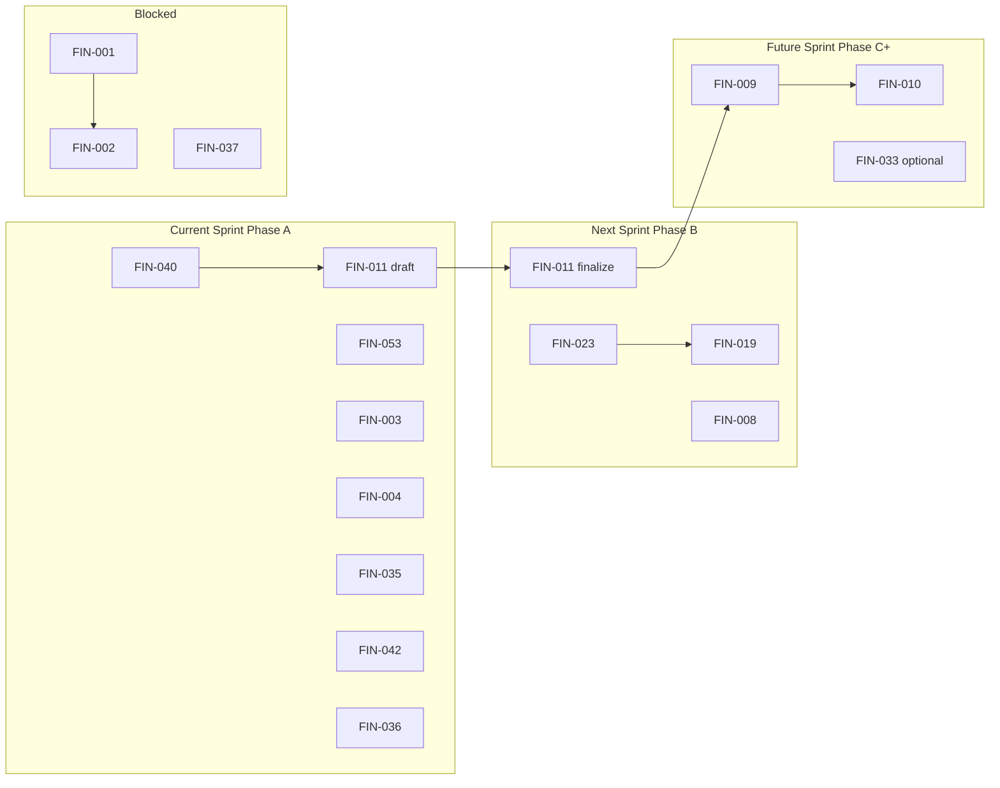

# FINCAVA Execution Backlog

**Planning sources:** `FINCAVA_MASTER_REGISTER.md` · `FINCAVA_PRIORITIZATION.md`  
**Status:** Active execution plan (no implementation tasks below)  
**Horizon:** Approved 60-day sequencing (Phase A → B → C)  
**Last updated:** 2026-05-31  

**How to use:** Move items to **Completed** when the expected outcome is verified. Do not delete FIN IDs. Do not add new FIN IDs here—only items from the master register.

---

## Sprint calendar (60-day plan)

| Sprint | Phase | Target window | Theme |
|--------|-------|---------------|--------|
| **Current** | A | Days 1–14 | Stay safe & stop losing leads |
| **Next** | B | Days 15–35 | Trust pipeline tells the truth |
| **Future** | C + queue | Days 36–60+ | Revenue loop tightens; post-60 hygiene |

---

## 1. Current Sprint

**Phase A — Days 1–14:** `FIN-040` → `FIN-011` (draft) → `FIN-053` → `FIN-003` → `FIN-004`, with `FIN-035` · `FIN-042` · `FIN-036` in parallel.

---

### FIN-040 — Replit ↔ GitHub sync discipline

| Field | Detail |
|-------|--------|
| **Reason for priority** | First in Phase A sequence; prevents production running stale or divergent code before any other changes ship |
| **Dependencies** | None |
| **Expected outcome** | Written deploy ritual adopted: GitHub is source of truth; pre-deploy check (`git fetch` / compare to `origin/main`); no blind Replit pulls; team knows recovery steps from `docs/TAKEOVER_PLAN.md` |
| **Estimated effort** | Small (process) |

---

### FIN-011 — Operator playbook documentation *(draft phase)*

| Field | Detail |
|-------|--------|
| **Reason for priority** | Unblocks solo founder ops without code; documents manual bridge for two supplier systems until FIN-001 is unblocked |
| **Dependencies** | FIN-040 (stable deploy context before documenting “how we run prod”) |
| **Expected outcome** | **Draft** playbook covering: supplier onboarding → score → graduate → publish; compliance PATCH flow; RFQ/inquiry triage steps; email-match bridge SOP; “stuck supplier” checklist (mitigates FIN-037 until Later) |
| **Estimated effort** | Small |

---

~~### FIN-053 — `UPLOAD_TOKEN_SECRET` in `.replit` shared env~~ ✅ **Completed 2026-06-06** — see Section 5.

---

### FIN-003 — Officer registration API path bug

| Field | Detail |
|-------|--------|
| **Reason for priority** | Tiny fix; unblocks field officer recruitment (supplier discovery at source) |
| **Dependencies** | Developer availability; FIN-040 deploy discipline |
| **Expected outcome** | `POST /api/officers/register` returns success; `/officer/register` form submits without 404 |
| **Estimated effort** | Tiny |

---

### FIN-004 — Contact form has no backend

| Field | Detail |
|-------|--------|
| **Reason for priority** | Stops invisible lead loss; Phase A “stop losing leads” theme |
| **Dependencies** | Resend configured; email template |
| **Expected outcome** | Contact submissions deliver to operator inbox (or configured `ADMIN_EMAIL`); no `console.log`-only submit |
| **Estimated effort** | Tiny |

---

### FIN-035 — Shallow health check (no DB probe)

| Field | Detail |
|-------|--------|
| **Reason for priority** | Parallel Phase A stability; false healthy during DB outages |
| **Dependencies** | None |
| **Expected outcome** | `/api/healthz` (or readiness endpoint) fails when PostgreSQL unreachable; Replit/deploy probes reflect real dependency health |
| **Estimated effort** | Tiny |

---

### FIN-042 — Automated DB backup not scheduled

| Field | Detail |
|-------|--------|
| **Reason for priority** | Parallel Phase A; business continuity before trust/revenue work |
| **Dependencies** | `BACKUP_SECRET_V2` in secrets; Replit cron or external scheduler |
| **Expected outcome** | Backups run on schedule (e.g. daily); retention verified; operator knows restore procedure |
| **Estimated effort** | Small |

---

### FIN-036 — No error monitoring or alerting (Sentry/Datadog)

| Field | Detail |
|-------|--------|
| **Reason for priority** | Parallel Phase A; founder sees failures before users |
| **Dependencies** | Monitoring account; FIN-035 recommended first (health signal) |
| **Expected outcome** | Production API + critical paths report errors; founder receives alerts; baseline dashboard or email notifications active |
| **Estimated effort** | Small |

---

## 2. Next Sprint

**Phase B — Days 15–35:** `FIN-023` → `FIN-019`; `FIN-011` (finalize); `FIN-008`.

---

### FIN-011 — Operator playbook documentation *(finalize phase)*

| Field | Detail |
|-------|--------|
| **Reason for priority** | Phase B completion of same register item; adds graduation, compliance PATCH, and introduction SOP detail after trust fixes land |
| **Dependencies** | Current Sprint draft; FIN-023 and FIN-019 outcomes reflected in doc |
| **Expected outcome** | **Final** playbook is single operator reference: ingestion, compliance queue, introduction handoff, env/flag deploy checklist (FIN-096), stuck-supplier recovery |
| **Estimated effort** | Small |

---

### FIN-023 — `rut_dian` body field vs eligibility gate mismatch

| Field | Detail |
|-------|--------|
| **Reason for priority** | First Phase B trust fix; suppliers incorrectly stuck NOT_READY block sellable supply |
| **Dependencies** | Onboarding route review; deploy via FIN-040 discipline |
| **Expected outcome** | Onboarding declarations align with `compliance_docs.rutDian`; eligible suppliers can progress through graduation when RUT criteria met |
| **Estimated effort** | Small |

---

### FIN-019 — AI compliance gaps not written back to `compliance_docs`

| Field | Detail |
|-------|--------|
| **Reason for priority** | Core trust credibility; follows FIN-023 in Phase B sequence |
| **Dependencies** | FIN-023 (cleaner gate inputs); scoring pipeline |
| **Expected outcome** | After AI scoring, `compliance_docs` booleans reflect AI-verified gaps where policy allows; admin drawer shows data consistent with graduation gate |
| **Estimated effort** | Small–Medium |

---

### FIN-008 — Hardcoded admin alert email on supplier onboard

| Field | Detail |
|-------|--------|
| **Reason for priority** | Phase B ops; faster supplier application review |
| **Dependencies** | `ADMIN_EMAIL` env var in Replit Secrets |
| **Expected outcome** | New supplier applications alert configurable operator address; no hardcoded single mailbox in code |
| **Estimated effort** | Tiny |

---

## 3. Future Sprint

**Phase C — Days 36–60:** `FIN-009` → `FIN-010`; optional `FIN-033`.  
**Post-60 queue:** items approved for after Current + Next, still within Phase I constraints.

---

### FIN-009 — Email notifications on new RFQ/inquiry

| Field | Detail |
|-------|--------|
| **Reason for priority** | Phase C revenue loop; faster response without dashboard polling |
| **Dependencies** | FIN-011 finalize (introduction SOP); Resend templates |
| **Expected outcome** | Operator and/or supplier receive email when buyer creates RFQ or inquiry; measurable reduction in time-to-first-response |
| **Estimated effort** | Small |

---

### FIN-010 — Admin "open introductions" dashboard

| Field | Detail |
|-------|--------|
| **Reason for priority** | Phase C capstone for concierge revenue path; depends on operator process from FIN-011 |
| **Dependencies** | FIN-011 (finalize); FIN-009 (optional but recommended first for parity) |
| **Expected outcome** | Single admin view lists open RFQs, inquiries, and items awaiting founder action; supports daily concierge triage |
| **Estimated effort** | Medium |

---

### FIN-033 — Ingestion batch confirm does not auto-trigger scoring (G9)

| Field | Detail |
|-------|--------|
| **Reason for priority** | Optional Phase C if engineering capacity; reduces manual “Score Now” after ingestion |
| **Dependencies** | Stable scoring pipeline (FIN-019); FIN-037 not required for hook-only approach |
| **Expected outcome** | Confirming ingestion batch triggers onboard/scoring pipeline without separate admin click |
| **Estimated effort** | Small |

---

### FIN-006 — Concierge introduction workflow not operator-optimized

| Field | Detail |
|-------|--------|
| **Reason for priority** | Revenue dashboard #1; largely addressed by FIN-011 + FIN-010; closure item after Phase C tooling |
| **Dependencies** | FIN-010; FIN-011 |
| **Expected outcome** | Founder runs introductions from one queue with documented SLA; no multi-page hunting for open deals |
| **Estimated effort** | Small (process validation; tooling via FIN-010) |

---

### FIN-020 — Three parallel compliance representations

| Field | Detail |
|-------|--------|
| **Reason for priority** | Follow-on trust hygiene after FIN-019 |
| **Dependencies** | FIN-019 |
| **Expected outcome** | Documented single source of truth for compliance state; plan for `interactions.metadata` vs `compliance_docs` alignment |
| **Estimated effort** | Medium |

---

### FIN-041 — Migration hygiene issues

| Field | Detail |
|-------|--------|
| **Reason for priority** | Post-60 stability; deferred until backups and monitoring stable (per prioritization) |
| **Dependencies** | FIN-042, FIN-036 |
| **Expected outcome** | Migration journal audited; orphan SQL resolved; post-merge uses `migrate` not `push`; package filter corrected |
| **Estimated effort** | Medium |

---

### FIN-043 — AI (Anthropic) dependency with limited fallback

| Field | Detail |
|-------|--------|
| **Reason for priority** | Operational runbook after monitoring live |
| **Dependencies** | FIN-036 |
| **Expected outcome** | Documented key rotation, outage playbook, and founder-visible signal when scoring/matching unavailable |
| **Estimated effort** | Small (process) |

---

### FIN-045 — Resend email skips send without API key

| Field | Detail |
|-------|--------|
| **Reason for priority** | Startup validation prevents silent auth failure |
| **Dependencies** | FIN-036 (alerts when misconfigured) |
| **Expected outcome** | API refuses start or logs critical warning if `RESEND_API_KEY` missing in production |
| **Estimated effort** | Tiny |

---

### FIN-044 — WhatsApp (Twilio) fails silently without credentials

| Field | Detail |
|-------|--------|
| **Reason for priority** | Onboarding channel visibility |
| **Dependencies** | FIN-036 |
| **Expected outcome** | Missing Twilio config surfaces in logs/alerts; operator knows WhatsApp step may be skipped |
| **Estimated effort** | Tiny |

---

### FIN-007 — Buyer matching gated and not workflow-integrated

| Field | Detail |
|-------|--------|
| **Reason for priority** | Revenue enabling after introduction queue exists |
| **Dependencies** | FIN-010; `ENABLE_MATCHING`; FIN-011 matching SOP |
| **Expected outcome** | Founder workflow: run match → review → intro → follow-up documented and practiced |
| **Estimated effort** | Medium |

---

### FIN-029 — Public trust badge refinement needed

| Field | Detail |
|-------|--------|
| **Reason for priority** | Buyer-facing trust after FIN-019 data is truthful |
| **Dependencies** | FIN-019; optionally FIN-022 (Later) |
| **Expected outcome** | `/suppliers` and profiles communicate verification meaning clearly to buyers |
| **Estimated effort** | Medium |

---

## 4. Blocked

Items are in the register as Must Do Now or Next but **cannot start** within the 60-day plan without a decision, large effort, or upstream completion.

---

~~### FIN-001 — Two supplier systems with no database link~~ ✅ **Completed 2026-06-06** — see Section 5.

---

### FIN-002 — Farm suppliers lack self-service login for compliance

| Field | Detail |
|-------|--------|
| **Reason for priority** | Must Do Now; CC-1 self-serve blocked |
| **Dependencies** | **Blocked by:** FIN-001; auth model decision |
| **Expected outcome** | *(When unblocked)* Farmers can complete compliance without full ADMIN mediation |
| **Estimated effort** | Large |

---

### FIN-065 — Compliance Concierge layer complete but farmer auth gap

| Field | Detail |
|-------|--------|
| **Reason for priority** | Compliance Must Do Now |
| **Dependencies** | **Blocked by:** FIN-002 |
| **Expected outcome** | *(When unblocked)* CC-1 usable by target farm suppliers |
| **Estimated effort** | Large |

---

### FIN-037 — Onboard/scoring pipeline has no durable job queue (H7)

| Field | Detail |
|-------|--------|
| **Reason for priority** | High operational risk; explicitly deferred from 60-day top 10 |
| **Dependencies** | **Blocked by:** Effort (Large); infrastructure decision |
| **Expected outcome** | *(When unblocked)* Scoring jobs survive process restart; recovery for stuck suppliers |
| **Estimated effort** | Large |
| **Mitigation until unblocked** | FIN-011 “stuck supplier” checklist; manual “Score Now” |

---

### FIN-058 — Field officers require full ADMIN role (G8)

| Field | Detail |
|-------|--------|
| **Reason for priority** | Security Must Do Now |
| **Dependencies** | **Blocked by:** FIN-059 role design; defer until after FIN-003 proves officer recruitment |
| **Expected outcome** | Officers do not require full admin access |
| **Estimated effort** | Medium |

---

### FIN-059 — FIELD_OFFICER role not implemented in route guards

| Field | Detail |
|-------|--------|
| **Reason for priority** | Prerequisite for FIN-058, FIN-066, FIN-067 |
| **Dependencies** | **Blocked by:** Scoped permission definition; FIN-003 complete |
| **Expected outcome** | Route guards accept `FIELD_OFFICER` with least privilege |
| **Estimated effort** | Medium |

---

### FIN-066 — Officer applications have no promotion flow (G10)

| Field | Detail |
|-------|--------|
| **Reason for priority** | Scale field team |
| **Dependencies** | **Blocked by:** FIN-003; FIN-059 |
| **Expected outcome** | Application → approved officer account without manual DB/user creation |
| **Estimated effort** | Medium |

---

### FIN-067 — Officer compliance workflow ADMIN-gated

| Field | Detail |
|-------|--------|
| **Reason for priority** | Field compliance at scale |
| **Dependencies** | **Blocked by:** FIN-059 |
| **Expected outcome** | Officers access compliance tools without ADMIN role |
| **Estimated effort** | Medium |

---

### FIN-005 · FIN-098–FIN-112 — Phase II+ / Parking Lot (representative block)

| Field | Detail |
|-------|--------|
| **Reason for priority** | Register items deferred by Phase I concierge strategy |
| **Dependencies** | **Blocked by:** Product strategy (no transactions, finance, logistics, public intelligence in Phase I) |
| **Expected outcome** | *(When unblocked)* Per `FINCAVA_MASTER_REGISTER.md` definitions |
| **Estimated effort** | Varies (Medium–XL) |
| **FIN IDs** | FIN-005, FIN-098, FIN-099, FIN-100, FIN-101, FIN-102, FIN-103, FIN-104, FIN-105, FIN-106, FIN-107, FIN-108, FIN-109, FIN-110, FIN-111, FIN-112 |

---

## 5. Completed

| Completed | FIN ID | Title | Verified outcome (summary) |
|-----------|--------|-------|----------------------------|
| 2026-06-06 | FIN-001 | Two supplier systems with no database link | `company_supplier_links` join table (migration `0028`) bridges `suppliers` ↔ `companies`. Many-to-many model supports cooperatives. Admin CRUD endpoints shipped. Both repos synced. Typecheck + 199/199 tests passing. Migration applied to dev + prod DB. |
| 2026-06-06 | FIN-053 | `UPLOAD_TOKEN_SECRET` in `.replit` shared env | Secret removed from committed `.replit`; moved to Replit Secrets. One-line deletion, no behaviour change. |

---

## Backlog flow (reference)

---

## Related documents

| Document | Role |
|----------|------|
| `FINCAVA_MASTER_REGISTER.md` | Item definitions (FIN-001–FIN-112) |
| `FINCAVA_PRIORITIZATION.md` | Dashboards, top 10, 60-day sequencing |
| `docs/SOURCE_OF_TRUTH_ROADMAP.md` | Layer gating policy |

---

## Changelog

| Date | Change |
|------|--------|
| 2026-05-31 | Initial backlog populated from approved 60-day sequencing |
