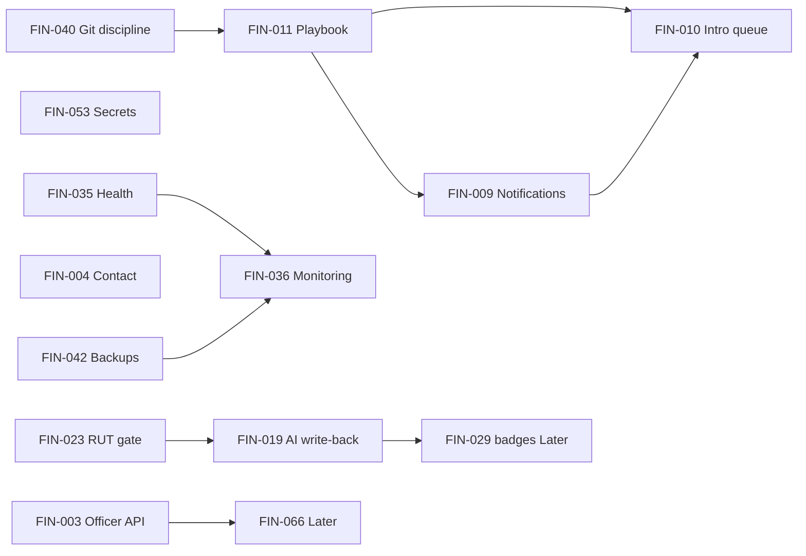

# FINCAVA Prioritization & Sequencing

**Source of truth for items:** `FINCAVA_MASTER_REGISTER.md` (112 items — definitions unchanged)  
**Status:** Active planning document  
**Last updated:** 2026-05-31  
**Scope:** Dashboard assignment, impact ranking, dependencies, and 60-day solo-founder top 10. No implementation prescribed.

---

## Dashboard definitions

| Dashboard | Governs |
|-----------|---------|
| **Founder Dashboard** | How you run the concierge business on the platform—process, playbooks, pipeline visibility, scope discipline, and product decisions that do not require large code changes |
| **Platform Stability Dashboard** | Whether the platform stays up, recoverable, observable, and safely deployable |
| **Trust & Verification Dashboard** | Whether suppliers are discoverable, scored, compliant, and credible to buyers |
| **Revenue Generation Dashboard** | Whether leads and introductions convert under the Phase I concierge model (RFQs, inquiries, matching—not checkout) |

Items have one primary dashboard; cross-links are noted where they affect another.

---

## 1. Founder Dashboard

**Purpose:** Operational command center for a solo founder running managed B2B introductions.

### Items (ranked by impact)

| Rank | FIN ID | Why it belongs here | Key dependencies |
|------|--------|---------------------|------------------|
| 1 | **FIN-011** | Operator playbook—how to run ingestion, graduation, introductions, and compliance without engineering context | None (founder-authored) |
| 2 | **FIN-006** | Concierge introduction workflow is founder-operated today; not optimized for solo triage | FIN-010 (tooling) |
| 3 | **FIN-010** | Single “open introductions” view is a founder operating surface, not a buyer feature | None |
| 4 | **FIN-018** | No deal-stage tracking—founder cannot measure concierge pipeline or revenue | Process/tool choice (spreadsheet OK for Phase I) |
| 5 | **FIN-007** | Buyer matching exists but needs founder workflow (match → intro → follow-up) | `ENABLE_MATCHING`, FIN-010 |
| 6 | **FIN-069** | Managed service cases need a service-delivery playbook | FIN-011 |
| 7 | **FIN-068** | Prescreening exists; founder needs SLA for review queue | FIN-011 |
| 8 | **FIN-090** | Strategic constraint: surface area vs solo capacity—drives hiring/scoping decisions | None (awareness) |
| 9 | **FIN-047** | Fragmented docs block founder self-sufficiency | FIN-011 consolidates |
| 10 | **FIN-040** | GitHub ↔ Replit sync discipline—founder deploy ritual | None (process) |
| 11 | **FIN-096** | Feature-flag deploy checklist—founder must not accidentally expose Layer III/IV | FIN-064 |
| 12 | **FIN-015** | Ingestion discover is manual follow-up—founder supplier-discovery process | Admin ingestion flow |
| 13 | **FIN-013** | Marketing campaigns need founder-led outreach strategy | Resend, admin campaigns |
| 14 | **FIN-014** | Origin stories / public metrics need founder content ops | Admin CMS |
| 15 | **FIN-017** | Dual buyer signup paths—founder/product decision on single funnel | UX review |
| 16 | **FIN-012** | Internal validation page—founder brand/URL policy | Product decision |
| 17 | **FIN-097** | Admin forced English—founder operator language preference | i18n (Later) |

**Not on Founder Dashboard (by design):** Engineering-heavy trust fixes (FIN-019+), infra (FIN-035+), Parking Lot revenue (FIN-099+).

---

## 2. Platform Stability Dashboard

**Purpose:** Keep production trustworthy while operating concierge workflows.

### Items (ranked by impact)

| Rank | FIN ID | Why it belongs here | Key dependencies |
|------|--------|---------------------|------------------|
| 1 | **FIN-036** | No error monitoring—you learn about failures from users | Sentry/account |
| 2 | **FIN-042** | Backups exist but are not scheduled—data-loss risk | Replit cron, `BACKUP_SECRET_V2` |
| 3 | **FIN-035** | Health check does not probe DB—false “healthy” during outages | None |
| 4 | **FIN-040** | Replit/GitHub drift—wrong code in production | Git process |
| 5 | **FIN-043** | Anthropic outage stops scoring/matching—core dependency | Key rotation runbook |
| 6 | **FIN-037** | Scoring pipeline not durable—silent supplier stuck states | Large (Later for full queue) |
| 7 | **FIN-041** | Migration hygiene—schema drift on deploy | Developer audit |
| 8 | **FIN-045** | Resend missing = silent auth failure | Startup env validation |
| 9 | **FIN-044** | WhatsApp silent failure—onboarding channel degrades | Twilio secrets |
| 10 | **FIN-053** | Secret in `.replit`—upload token exposure | Replit Secrets |
| 11 | **FIN-003** | Officer registration 404—broken recruitment path | None (tiny fix) |
| 12 | **FIN-008** | Hardcoded admin alert email—missed supplier applications | `ADMIN_EMAIL` |
| 13 | **FIN-051** | Admin seed password env—misconfiguration risk | Post-setup removal |
| 14 | **FIN-064** | Backend/frontend flag mismatch—deploy surprises | Deploy checklist (FIN-096) |
| 15 | **FIN-038** | In-memory email queue—lost emails on restart | Later |
| 16 | **FIN-039** | CD YAML broken—no GitHub deploy path | Later (Replit manual OK for Phase I) |
| 17 | **FIN-052** | CI vs Replit deploy split—two systems to watch | FIN-039 |
| 18 | **FIN-049** | Thin route tests—regression risk | Later |
| 19 | **FIN-050** | No job system—scale/recovery ceiling | Later |
| 20 | **FIN-046** | README outdated—engineer onboarding friction | Later |
| 21 | **FIN-048** | `attached_assets` noise—discovery clutter | Later |
| 22 | **FIN-054** | Plaintext token columns—incomplete migration | FIN-071 |
| 23 | **FIN-055** | Plaintext claim tokens | Later |
| 24 | **FIN-056** | Partial rate limiting | Later |
| 25 | **FIN-057** | AI cost exposure | Later |
| 26 | **FIN-060** | Backup timing-safe compare | Later |
| 27 | **FIN-061** | Discovery SSRF surface | Later (admin-only) |
| 28 | **FIN-062** | Partial transaction flag gate | Parking Lot alignment |
| 29 | **FIN-063** | IDOR test gap | Later |
| 30 | **FIN-072–FIN-088** | Maintainability debt—not stability unless they break deploy | Later / Parking Lot |
| 31 | **FIN-094** | Single DB instance | Later at scale |
| 32 | **FIN-095** | Replit storage sidecar coupling | Later |

**Cross-dashboard:** FIN-003 also supports Trust (field discovery). FIN-053 is Security but primary home is Stability.

---

## 3. Trust & Verification Dashboard

**Purpose:** Phase I promise—verified Colombian suppliers buyers can trust.

### Items (ranked by impact)

| Rank | FIN ID | Why it belongs here | Key dependencies |
|------|--------|---------------------|------------------|
| 1 | **FIN-019** | AI gaps not written to `compliance_docs`—badges/gates show stale data | Scoring pipeline |
| 2 | **FIN-023** | `rut_dian` vs eligibility gate mismatch—suppliers stuck NOT_READY | Onboarding route |
| 3 | **FIN-020** | Three compliance representations—no single truth | FIN-019 |
| 4 | **FIN-001** | Two supplier systems—identity breaks trust chain | Product decision (bridge scope) |
| 5 | **FIN-002** | Farmers cannot self-serve compliance UI | FIN-001, auth model |
| 6 | **FIN-065** | CC-1 built but farmer auth gap blocks self-serve compliance | FIN-002 |
| 7 | **FIN-029** | Public trust badges need buyer-meaningful verification | FIN-019, FIN-022 |
| 8 | **FIN-033** | Ingestion confirm does not auto-score—supply pipeline stalls | Pipeline hook |
| 9 | **FIN-024** | Manual transitions skip re-evaluation—state vs score drift | Graduation service |
| 10 | **FIN-030** | Suppliers cannot see own graduation state | FIN-001 bridge |
| 11 | **FIN-022** | Verification levels not in schema/UI | Additive schema |
| 12 | **FIN-021** | `compliance_score` never written | FIN-019 |
| 13 | **FIN-025** | Compliance PATCH no interaction audit | Interactions insert |
| 14 | **FIN-058** | Officers need ADMIN—wrong access model for field trust work | FIN-059 |
| 15 | **FIN-059** | FIELD_OFFICER not in route guards | Role design |
| 16 | **FIN-066** | Officer apps not promoted to accounts | FIN-003, FIN-059 |
| 17 | **FIN-067** | Officer compliance ADMIN-gated | FIN-059 |
| 18 | **FIN-016** | Token claim flow still open | FIN-001 |
| 19 | **FIN-031** | Duplicate farms/economics rows | DB constraint |
| 20 | **FIN-028** | Legacy `status` vs `sellable_status` | Later |
| 21 | **FIN-027** | Pathway A/B/C/D undefined in code | Product doc |
| 22 | **FIN-026** | Product placeholders hidden in admin | Admin UI |
| 23 | **FIN-032** | `harvest_months` → wrong column | Onboarding mapping |
| 24 | **FIN-034** | Static data in intelligence pages | Later (admin-only) |
| 25 | **FIN-070** | Export mode underused publicly | FIN-029 |
| 26 | **FIN-071** | Token hashing incomplete | FIN-054 |
| 27 | **FIN-091** | `products.supplier_id` no FK | Later |

**Cross-dashboard:** FIN-058/059 also Security. FIN-001/002 also Architecture.

---

## 4. Revenue Generation Dashboard

**Purpose:** Concierge revenue path—leads → RFQs/inquiries → founder-facilitated introductions (not checkout).

### Items (ranked by impact)

| Rank | FIN ID | Why it belongs here | Key dependencies |
|------|--------|---------------------|------------------|
| 1 | **FIN-006** | Introduction workflow is the revenue engine; not operator-optimized | FIN-010 |
| 2 | **FIN-010** | No unified open RFQ/inquiry queue—slow deal velocity | None |
| 3 | **FIN-004** | Contact form drops leads | Resend |
| 4 | **FIN-009** | No email on new RFQ/inquiry—slow response | Resend |
| 5 | **FIN-007** | AI matching underused for curated intros | `ENABLE_MATCHING`, FIN-010 |
| 6 | **FIN-008** | Missed supplier application alerts | `ADMIN_EMAIL` |
| 7 | **FIN-018** | No pipeline/deal tracking—cannot optimize conversion | Process/tool |
| 8 | **FIN-001** | Broken supplier identity limits listable trustworthy supply | Bridge scope |
| 9 | **FIN-029** | Weak trust signals reduce buyer conversion | Trust dashboard |
| 10 | **FIN-017** | Buyer signup friction | UX |
| 11 | **FIN-013** | Campaign tooling dormant | Founder strategy |
| 12 | **FIN-014** | Content ops for discovery/trust | Founder time |

**Parking Lot (not Phase I concierge revenue):** FIN-005, FIN-099, FIN-100, FIN-101, FIN-102, FIN-103, FIN-112, FIN-098.

**Cross-dashboard:** FIN-006/010 appear on Founder and Revenue (same item, dual lens).

---

## Items excluded from all four dashboards

These remain in `FINCAVA_MASTER_REGISTER.md` but are **Parking Lot** or **non–Phase I** per constraints:

| FIN IDs | Reason |
|---------|--------|
| FIN-005, FIN-098, FIN-099–FIN-112 | Transactions, finance, logistics, public intelligence, microservices, table merge, lots/certs migrations |
| FIN-074, FIN-075, FIN-077, FIN-083, FIN-085, FIN-087, FIN-088, FIN-089 | Cosmetic / dead code / placeholder pages |
| FIN-092, FIN-106, FIN-107 | Major structural moves explicitly out of scope |
| FIN-104 | WhatsApp OTP—large; alternative to FIN-002, not 60-day default |

**FIN-090** sits on Founder Dashboard as strategic scope control, not a build task.

---

## Top 10 for the next 60 days (solo founder)

**Criteria:** Phase I concierge; additive/small where code is needed; mix of founder-only ops and bounded engineering; excludes Large/XL (FIN-001 full bridge, FIN-002 auth, FIN-037 job queue, FIN-099+).

| # | FIN ID | Title | Dashboard | Why top 10 | Realistic owner |
|---|--------|-------|-----------|------------|-----------------|
| 1 | **FIN-011** | Operator playbook | Founder | Unblocks everything else without code; documents email-bridge for FIN-001 until eng | **Founder** |
| 2 | **FIN-040** | Replit ↔ GitHub sync discipline | Stability | Prevents shipping wrong code; zero architecture change | **Founder** |
| 3 | **FIN-053** | Move `UPLOAD_TOKEN_SECRET` to secrets | Stability | Tiny; reduces breach risk | **Founder + ~1h eng** |
| 4 | **FIN-003** | Officer registration API path | Stability / Trust | Tiny; unblocks field recruitment (supplier discovery) | **Eng** |
| 5 | **FIN-004** | Contact form backend | Revenue | Tiny; stops lead loss | **Eng** |
| 6 | **FIN-035** | Deep health check | Stability | Tiny; real outage detection | **Eng** |
| 7 | **FIN-042** | Schedule DB backups | Stability | Small; business continuity | **Founder + eng** |
| 8 | **FIN-036** | Error monitoring (e.g. Sentry) | Stability | Small; founder sees failures before users | **Founder setup** |
| 9 | **FIN-023** | `rut_dian` / eligibility alignment | Trust | Small; unblocks graduation → sellable supply | **Eng** |
| 10 | **FIN-019** | AI compliance → `compliance_docs` write-back | Trust | Small–medium; makes verification credible for buyers | **Eng** |

### Honorable mentions (days 45–60 if capacity)

- **FIN-008** — Admin alert email on supplier onboard  
- **FIN-009** — Email notifications on new RFQ/inquiry  
- **FIN-010** — Admin “open introductions” dashboard (after FIN-011 process)

### Explicitly not in top 10 (60 days)

| FIN ID | Why deferred |
|--------|----------------|
| FIN-001, FIN-002 | Large; require identity decision—cover operationally in FIN-011 first |
| FIN-037 | Large job queue—mitigate with FIN-011 “stuck supplier” checklist until Later |
| FIN-058, FIN-059, FIN-066 | Medium role work—after FIN-003 and officer recruitment proof |
| FIN-006 alone | Process partially solved by FIN-011; FIN-010 is the code capstone in days 45–60 |
| FIN-041 | Medium migration audit—after backups and monitoring stable |

---

## 60-day sequencing

### Phase A — Days 1–14: Stay safe & stop losing leads

```
FIN-040 → FIN-011 (draft) → FIN-053 → FIN-003 → FIN-004
Parallel: FIN-035, FIN-042, FIN-036 (monitoring + backups)
```

### Phase B — Days 15–35: Trust pipeline tells the truth

```
FIN-023 → FIN-019
FIN-011 (finalize: graduation, compliance PATCH, introduction SOP)
FIN-008 (admin alert email)
```

### Phase C — Days 36–60: Revenue loop tightens

```
FIN-009 (RFQ/inquiry notifications)
FIN-010 (open introductions admin view) — depends on FIN-011 process
Optional: FIN-033 (auto-score on ingestion confirm) if eng time remains
```

### Do not start in 60 days

- FIN-099+  
- FIN-001 / FIN-002 full build  
- FIN-037  
- FIN-058 / FIN-059 bundle  

---

## Dependency graph (top 10 + Phase C)



---

## Dashboard coverage summary

| Dashboard | Item count (primary) | Must Do Now from register | 60-day focus |
|-----------|---------------------:|--------------------------:|--------------|
| Founder Dashboard | 17 | FIN-006, FIN-011 | FIN-011, FIN-040, FIN-006 process via playbook |
| Platform Stability Dashboard | 32 | FIN-003, FIN-035, FIN-036, FIN-040, FIN-042, FIN-043, FIN-053 | FIN-003, FIN-035, FIN-036, FIN-042, FIN-053, FIN-040 |
| Trust & Verification Dashboard | 27 | FIN-001, FIN-002, FIN-019, FIN-020, FIN-023, FIN-065 | FIN-023, FIN-019 (not FIN-001/002 full) |
| Revenue Generation Dashboard | 12 active + 14 Parking Lot | FIN-004, FIN-006 | FIN-004; FIN-009/010 in Phase C |
| Parking Lot / other | 24 | — | No work |

**Net:** All 112 register items are accounted for—88 across the four dashboards (with intentional overlap on FIN-006/010), 24 in Parking Lot or engineering-debt “Later” buckets not assigned as Phase I dashboard work.

---

## Related documents

| Document | Role |
|----------|------|
| `FINCAVA_MASTER_REGISTER.md` | Canonical item definitions (FIN-001–FIN-112) |
| `docs/SOURCE_OF_TRUTH_ROADMAP.md` | Product layers and feature-flag policy |
| `Supplier_Layer_Architecture.md` | Supplier domain flows |
| `docs/TAKEOVER_PLAN.md` | Engineer onboarding |

---

## Changelog

| Date | Change |
|------|--------|
| 2026-05-31 | Initial prioritization saved from discovery review session |
